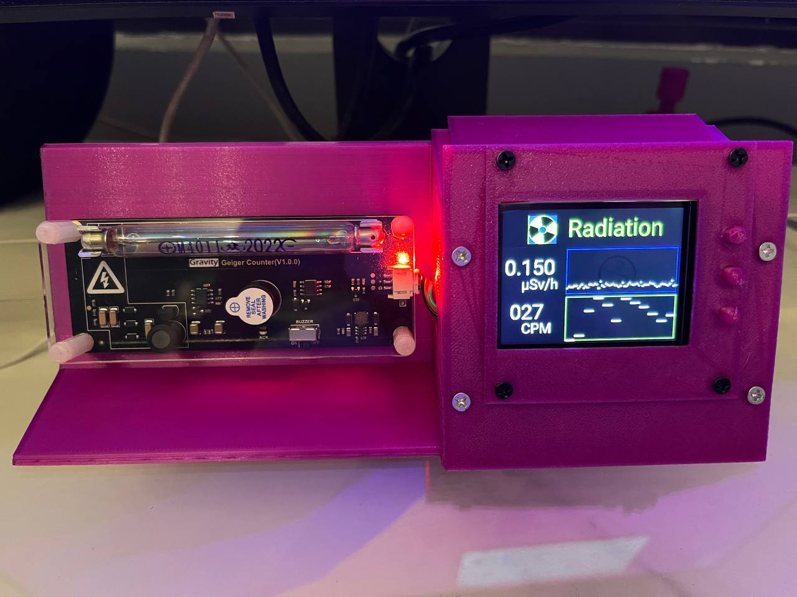

- macOS driver for the WCH USB-to-SERIAL devices
  https://github.com/WCHSoftGroup/ch34xser_macos

- Display Device: LilyGo_T4_V13 240x320
  https://github.com/Xinyuan-LilyGO/LilyGo_Txx/tree/master/LilyGo_Txx

- GPIO layout
  https://github.com/Xinyuan-LilyGO/LilyGo_Txx/blob/master/LilyGo_Txx/T4_V13.h

- ESPHome ILI9341 TFT LCD
  https://esphome.io/components/display/ili9341.html

- GM Tube Info (M4011 - Glass tube)
  https://sites.google.com/site/diygeigercounter/technical/gm-tubes-supported

- Don't operate it without a cover. There's roughly 400 V across that M4011 tube, which might shock you.

Here are the links where I bought my parts

1. DFRobot Geiger Counter

https://www.aliexpress.com/item/1005004157549971.html

2. LILYGO® TTGO 2.4 LCD ESP32 Dev Board

https://www.aliexpress.com/item/32854502767.htmlHere

